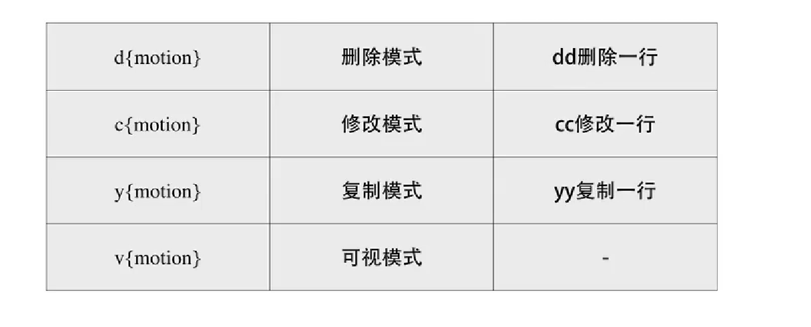

[TOC]

# Vim的使用技巧与策略

# 普通模式

## 移动光标

上k下j左h右l

## 退出vim

普通模式下:q(只读)  或者:wq(写)

## 基于单词的移动

- w 当前单词的后一个单词单词头
- ge 当前单词的前一个单词尾
- e 当前单词尾
- b 当前单词头

## 对字符查找

f F t T , ; 

## 撤回

u

# 插入模式

## 进入插入模式

i 光标前插入

c 删除该行,并进入可视模式

a 光标后插入

## 退出插入模式

esc

# 可视模式

## 进入可视模式

v

## 全选一行

V 任何模式都行

## 选择一列

进入可视模式ctrl+v

