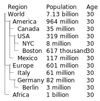

# 我的项目

## 目录 (Table of Contents)

- [介绍](#介绍)
- [Installation Guide](#installation-guide)
- [导入图片测试](#导入图片测试)
  - [正常测试](#正常测试)
  - [居中测试](#居中测试)
  - [图片超链接居中测试](#图片超链接居中测试)

---

## 介绍

这里是项目的简介，可以写一些项目描述信息。

---

## Installation Guide

安装指南：  

```bash
pip install mypackage 
```

## 导入图片测试
### 正常测试
</br>
或者带有title的</br>
</br>
缺点是这些没法居中表示,图片偏左,而且需要手动换行</br>

### 居中测试
<p align="center">
  
</p>


### 图片超链接居中测试

<p align="center">
    <a href = "https://github.com" target="_blank">
        
    </a>
</p>
这是最简洁,最全面添加图片的方式了


